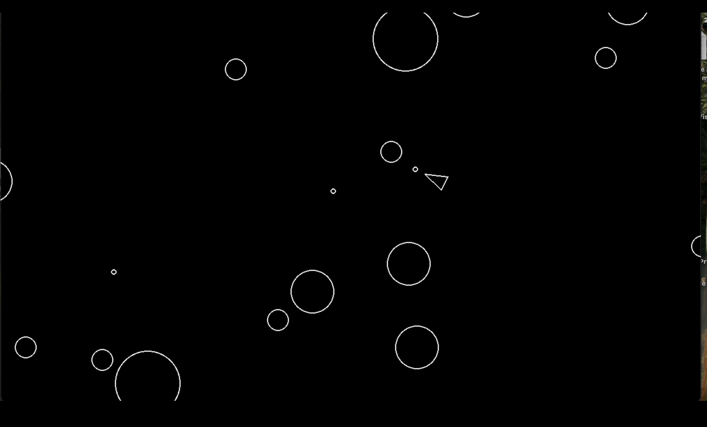

## Asteroid Blaster


A classic Asteroids-style game built with Python and Pygame.

## Pictures



## Features

- Player-controlled spaceship
- Rotating and shooting
- Asteroid movement and splitting
- Collision detection
- Score tracking

## Requirements

- Python 3.10+
- uv

## How to play

uv run main.py

## Controls

W / S: Move forward/backward
A / D: Rotate
Space: Shoot

## Possiible future additions

- Adding a scoring system
- Implementing multiple lives and respawning
- Adding an explosion effect for the asteroids
- Adding acceleration to the player movement
- Making the objects wrap around the screen instead of disappearing
- Adding a background image
- Creating different weapon types
- Making  the asteroids lumpy instead of perfectly round
- Making the ship have a triangular hit box instead of a circular one
- Adding a shield power-up
- Adding a speed power-up
- Adding bombs that can be dropped

## Changing Game settings

Before playing, you can mess with the constants.py file and change variables to play the game how you would like to play.
Have fun and Enjoy!!

## Installation

```bash
git clone https://github.com/your-name/your-repo.git
cd your-repo
uv sync 


